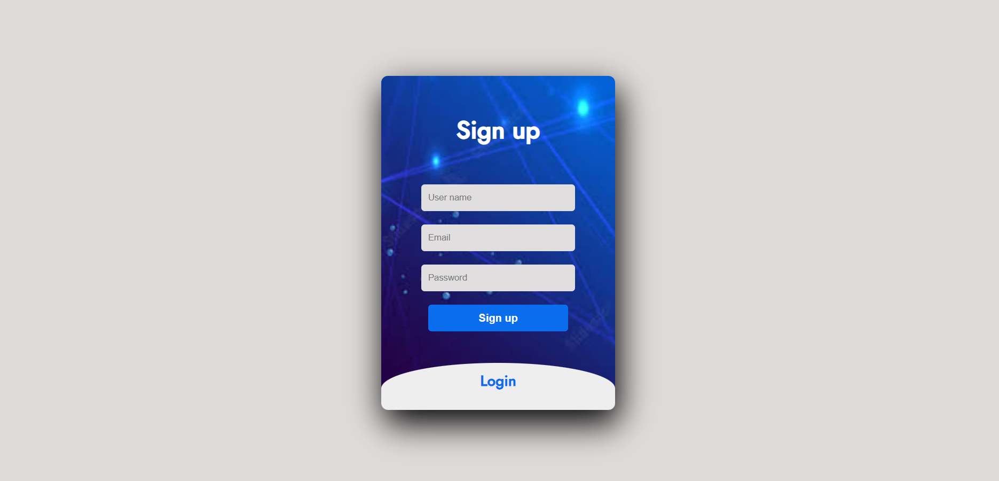

# VLink - Real Time Video and Chat Application

# VLink - Real Time Video and Chat Application

**VLink is a communications platform that allows users to connect with video, audio, screen share, and chat.**
**The power of collaboration is that it can turn a group of individuals into a team empowered to achieve great things
Vlink is a type of application that enables users to connect with others in real-time over the internet.
It includes features that allows user to chat and video call with each other.**

## Deployment Link - https://vlink-app.netlify.app

## Tech Stack

**Client:** HTML | CSS | Javascript

**Server:** Node.js | Express.js

**Database:** MongoDB | Redis

**npm packages:** WebRTC | Socket.io | Bcrypt | PassPort | cors | JWT | dotenv | nodemailer | mongoose | express

**github:** To maintain repository and collabration and version control.

**VS Code:** To write HTML,CSS and JavaScript code.

**Google Chrome :** To check the functionality and run the code.

## Frontend Part

- Home Page
- Login/Signup
- Dashboard
- Google OAuth
- Payment Page
- Admin Page

## Backend Part

- Authentication using JWT
- implementation using Socket.io
- fully functional Video and Audio icons

## Database

- MongoDB
- Redis

## Features

- Chatting
- Video Calling

## Application Guide to use features

### To use {Video calling} feature -->

- First Create room
- User can join the call by using the room ID
- To end the call click on hang on button

### To use {Chat} feature -->

- First Create room
- User can join the room using room ID after login
- Time is displayed of message
- Notifies User info

## Group Members Info

1. Ishupriya Rath (Team Lead)

   > - e-Mail: ishupriyarath@gmail.com
   > - GitHub: https://github.com/Sonu598

2. Dharamveer

   > - e-Mail:dharamveer945734.com
   > - GitHub: https://github.com/Dharamveer9457

3. Sambhaji Dhore

   > - e-Mail: sambhajisd4@gmail.com
   > - GitHub: https://github.com/sampatil98

4. Sayali Jadhav

   > - e-Mail: jadhavsayalip2316@gmail.com
   > - GitHub: https://github.com/sayalip2316

5. Yogita Mane
   > - e-Mail: maneyogita2021@gmail.com
   > - GitHub: https://github.com/Yogita2021

 

## Home Page

## Signing Page

## Dashboard Page

## Video Chat Platform

## Chat Platform

## Admin Dashboard Page

